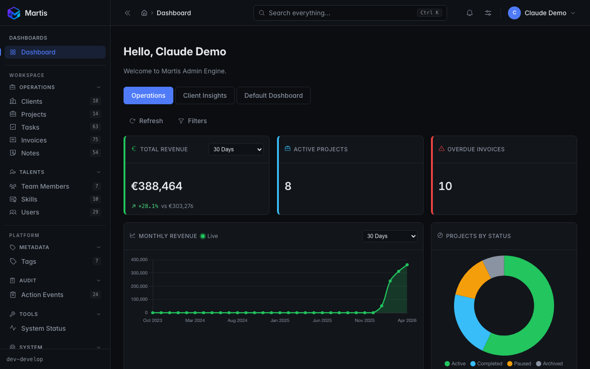
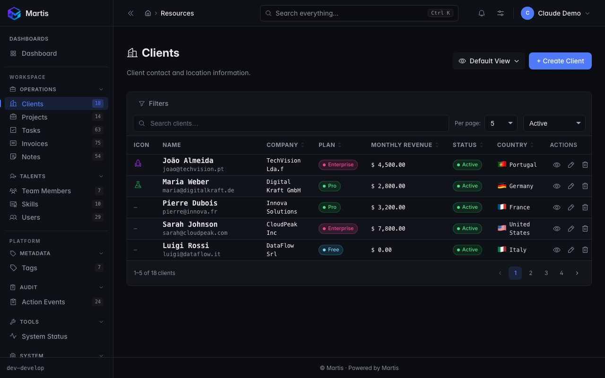
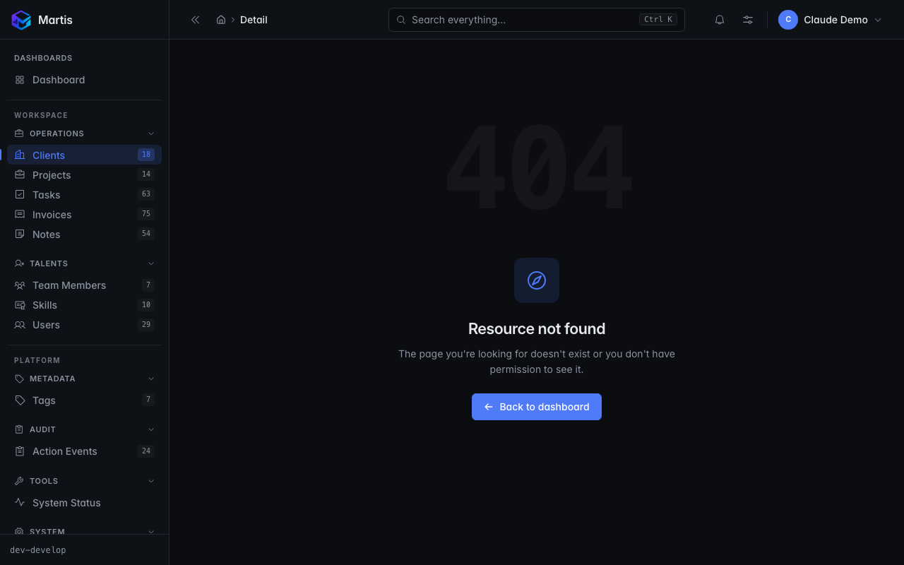
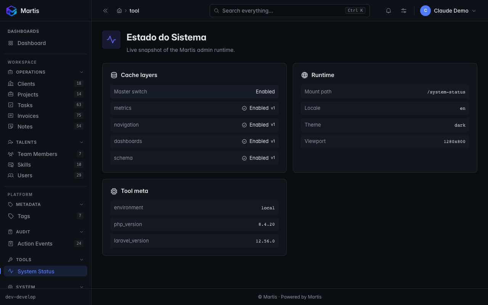
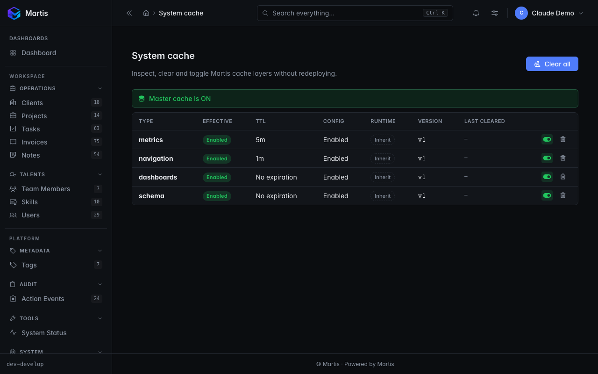
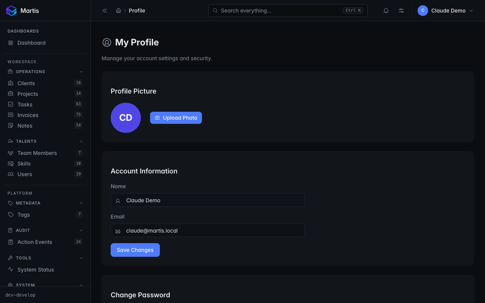

<p align="center">
  
</p>

<p align="center">
  <strong>A modern, open-source admin engine for Laravel.</strong><br>
  React-first. Context-aware. Built for developers who ship.
</p>

<p align="center">
  <a href="https://github.com/Real-Edge-FX/martis/releases"></a>
  
  
  
  <a href="LICENSE"></a>
</p>

---

Martis is a full-featured, React-first admin panel engine for Laravel. It is built on **PrimeReact**, **Tailwind CSS**, **React Router**, and **TanStack Query**, giving you a modern SPA experience with the power and simplicity of Laravel on the backend.

## Installation

```bash
composer require martis/martis
```

```bash
php artisan martis:install
```

Visit `/martis` to log in. See the [Installation Guide](docs/installation-guide.md) for full setup.
The install command publishes precompiled assets, configuration, and scaffolds the admin panel in your Laravel application. End users do not need to run Vite or install Node dependencies in the host app.

When you want Martis to provision the optional profile support columns as well, use:

```bash
php artisan martis:install --with-profile
```

That profile migration safely adds the avatar and 2FA columns only when they are missing. If your app already stores avatar paths in a different column, pass it explicitly:

```bash
php artisan martis:install --with-profile --avatar-column=avatar_path
```

## Upgrade

When updating Martis in an existing Laravel application, use:

```bash
composer update martis/martis
php artisan martis:install --force
```

This is the recommended upgrade flow because Composer updates the package inside `vendor/`, while Martis publishes static assets into `public/vendor/martis/`. Those published files must be refreshed after package updates.

If the release contains no frontend changes, re-running `martis:install --force` is still safe and remains the recommended command.

If you also use the optional profile migration, re-run the install command with the same flag you used originally:

```bash
composer update martis/martis
php artisan martis:install --force --with-profile --avatar-column=avatar_path
```

## Requirements

| Dependency | Version |
|------------|---------|
| PHP | 8.2+ |
| Laravel | 11+ or 12+ |
| Node.js | 20+ (contributors only) |
| pnpm | 8+ (contributors only) |

## Screenshots

<table>
<tr>
<td></td>
<td></td>
</tr>
<tr>
<td align="center"><sub>Dashboard — multiple dashboards with metric cards, filters, polling</sub></td>
<td align="center"><sub>Resource index — sticky filters, sort, pagination, per-row actions</sub></td>
</tr>
<tr>
<td></td>
<td></td>
</tr>
<tr>
<td align="center"><sub>Resource create — multi-column grid layout, reactive fields, save variants</sub></td>
<td align="center"><sub>Custom Tool — free-form sidebar pages with <code>Tool::boot()</code> lifecycle</sub></td>
</tr>
<tr>
<td></td>
<td></td>
</tr>
<tr>
<td align="center"><sub>System cache — per-subsystem toggle / version / clear</sub></td>
<td align="center"><sub>Profile — avatar, 2FA enrolment, recovery codes</sub></td>
</tr>
</table>

## Features at a Glance

- **50 field types** — text, select, date, file, image, code, markdown, rich text, badge, status, currency, country, key-value, sparkline, audio, slug, timezone, icon picker, and 32 more
- **12 relationship fields** — BelongsTo, HasOne, HasOneOfMany, HasOneThrough, HasMany, HasManyThrough, BelongsToMany, MorphTo, MorphOne, MorphOneOfMany, MorphMany, MorphToMany — all with full inline CRUD, attach/detach, pivot fields, soft-delete dropdown, and 9 toolbar hide flags
- **Reactive forms** — `Field::dependsOn()` server-side resolution, closure-aware setters across the field API, context-aware validation (creationRules / updateRules / immutable), 4 save variants
- **Filters & Lenses & Metrics & Dashboards & Menus** — all feature-complete
- **Actions** — row-level, bulk, standalone, queued, with confirmation, validation, pivot fields, custom React components, dry-run, and per-action icons
- **Custom Tools (v0.10)** — free-form sidebar pages with `Tool::boot()` lifecycle, `ToolServiceProvider` for Composer-package distribution, asset publishing, and the `martis:tool` generator
- **Impersonation (v0.10)** — opt-in master switch + `martis-impersonate` Gate + REST surface + built-in banner
- **SSO** — Azure / Google / GitHub / custom providers, role mapping (Spatie or callable), `martis:sso` generator
- **Override system** — 4-tier component resolution: replace any view, field, layout, or drawer without forking
- **Global search** — per-resource config, `searchOrderBy()` hook, "View all N matches" overflow
- **Sticky views** — per-resource session state for search / sort / filters / pagination / trashed / `filtersOpen`
- **In-app notifications** — topbar bell over Laravel's standard `notifications` table
- **Cache control surface** — `MartisCache::extend()` + admin page (`/martis/system/cache`)
- **Authentication & Profile** — built-in login, 2FA (TOTP), avatar upload, user menu, password reset
- **Locale extensibility** — per-key deep merge, configurable host-app namespaces, configurable fallback chain
- **i18n** — English, Portuguese (PT), Portuguese (BR) out of the box
- **Custom cards** — build custom dashboard cards with `martis:card` (PHP + React scaffolding, auto-registration)
- **Comprehensive theme system** — 94 CSS variables across 13 categories (colors, typography, radius, shadows, charts, file icons). Dark + light modes. Generated by `martis:theme` with all variables documented.
- **Panels and tabs** — group fields visually with collapsible panels and tab navigation
- **Grid layout** — multi-column form layouts via `Section::columns()` and `Field::span()`; responsive by default, zero config
- **Test coverage** — 1613 Pest + 84 Vitest = **1697 passing**, 0 failing

## Documentation

Full documentation lives in the [`docs/`](docs/) directory.

### Getting Started

| Document | Description |
|----------|-------------|
| [Installation Guide](docs/installation-guide.md) | Step-by-step: Composer, assets, config, first resource |
| [Quick Start](docs/setup/quickstart.md) | Dev workflow, hot reload, first CRUD |
| [Troubleshooting](docs/setup/troubleshooting.md) | Common issues and solutions |

### Core Concepts

| Document | Description |
|----------|-------------|
| [Resources](docs/resources.md) | Resource classes, lifecycle hooks, authorization, search, pagination, soft deletes, exceptions |
| [Grid Layout](docs/grid-layout.md) | Multi-column form layouts: Section::columns() and Field::span() |
| [Fields Reference](docs/fields.md) | All field types — configuration, visibility flags, validation, enums |
| [Relationships](docs/relationships.md) | All 12 types — BelongsTo, HasOne, HasOneOfMany, HasOneThrough, HasMany, HasManyThrough, BelongsToMany (pivot fields), MorphTo, MorphOne, MorphOneOfMany, MorphMany, MorphToMany — with shared toolbar, soft-delete dropdown, per-field hide flags |
| [Filters](docs/filters.md) | Select, boolean, date, and date-range filters — defining, customizing, and composing index filters |
| [Lenses](docs/lenses.md) | Alternative resource views (query, fields, filters, polling) + summary rows, query cache, default filters, URL state sync |
| [Metrics](docs/metrics.md) | Value, trend, partition, progress, activity feed, and endpoint table metrics — query helpers, ranges, caching, card width, auto-refresh |
| [Dashboards](docs/dashboards.md) | Multiple dashboards, dashboard filters, refresh button, registration |
| [Actions](docs/actions.md) | Inline, bulk, standalone, queued, custom components, authorization, audit log |
| [Default Row Actions](docs/default_row_actions.md) | Built-in view/edit/delete column on every index, auto-disabled per policy, composable with custom inline actions |
| [Panels & Tabs](docs/panels-and-tabs.md) | Form/detail panel layout primitives + tab navigation |
| [Repeater](docs/repeater.md) | JSON, HasMany, polymorphic and templated row editor |
| [Menus](docs/menus.md) | Declarative navigation API for sidebar groups and items |
| [Preferences](docs/preferences.md) | Per-user theme, accent, density, locale, reduced-motion |
| [Sticky Views](docs/sticky_views.md) | Per-user view state persistence on resource index pages |
| [Notifications](docs/notifications.md) | In-app bell dropdown, distinct from toasts, backed by Laravel notifications |
| [Cache](docs/cache.md) | Per-subsystem cache layer with config/env/runtime control, bypass header, and admin panel |
| [Internationalisation](docs/i18n.md) | Locale layers (PHP + i18next + preferences) |
| [Override System](docs/overrides.md) | 4-tier component resolution: replace any view, field, layout, or drawer |
| [Built-in Components](docs/components.md) | UI components, hooks (useEventBus, useError), tooltip standard |
| [Theming Guide](docs/theming.md) | Complete reference for all 94 CSS variables (colors, typography, radius, shadows, charts) |
| [Authentication](docs/authentication.md) | Login, 2FA, user profile, avatar, user menu |
| [SSO](docs/sso.md) | Azure / Google / GitHub / custom providers, role mapping, Spatie integration, generator command |
| [Impersonation](docs/impersonation.md) | Login as another user — opt-in master switch + `martis-impersonate` gate + REST + built-in banner (v0.10) |
| [Custom Tools](docs/tools.md) | Free-form sidebar pages — `Martis::tools([...])`, `Tool::boot()` lifecycle, `ToolServiceProvider`, `martis:tool` generator (v0.10) |
| [Tool boot() patterns](docs/tool-boot-patterns.md) | When to use `Tool::boot()` vs `AppServiceProvider::boot()` — decision rubric + 4 in-app patterns |
| [Authorization](docs/authorization.md) | Policy contract, enforcement endpoints, UI flags |
| [Configuration](docs/configuration.md) | Complete `config/martis.php` reference + host `MartisServiceProvider` for code-side registrations |
| [Loader](docs/loader.md) | Page loader configuration and customization |

### Architecture & API

| Document | Description |
|----------|-------------|
| [Technology Stack](docs/architecture/stack.md) | PHP, Laravel, React, PrimeReact, Tailwind, Vite, testing tools |
| [Architectural Decisions](docs/architecture/decisions.md) | ADRs: why Inertia, why PrimeReact, why contracts |
| [REST API Overview](docs/api/overview.md) | All endpoints, request/response formats, authentication, error handling |

### Project Status

| Document | Description |
|----------|-------------|
| [Martis Differentials](docs/differentials.md) | All Martis-only features grouped by subsystem |
| [Release Process](docs/release-process.md) | Tag creation playbook |
| [Documentation Index](docs/README.md) | Full docs hub with quick links |

## Tech Stack

| Layer     | Technology |
|-----------|-----------|
| Backend   | PHP 8.2+, Laravel 11/12 |
| Frontend  | React 18, TypeScript, PrimeReact, Tailwind CSS |
| Icons     | Phosphor Icons |
| Build     | Vite, pnpm |
| Testing   | Pest (PHP), Vitest (JS), PHPStan Level 8 |

## License

MIT — see [LICENSE](LICENSE).
